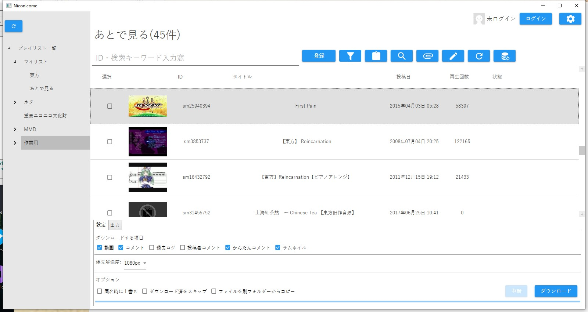
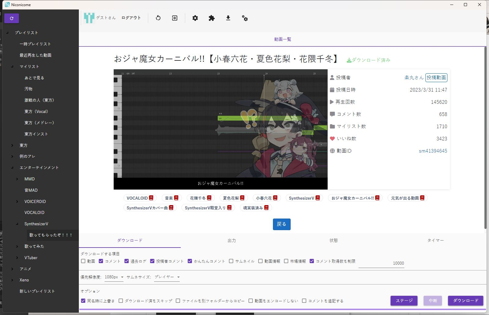
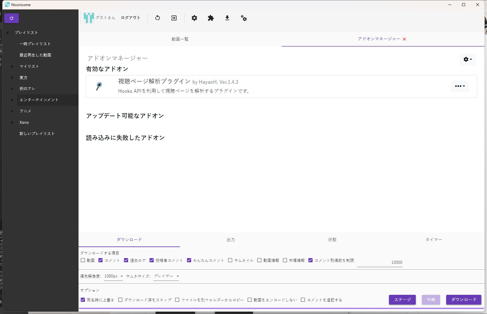
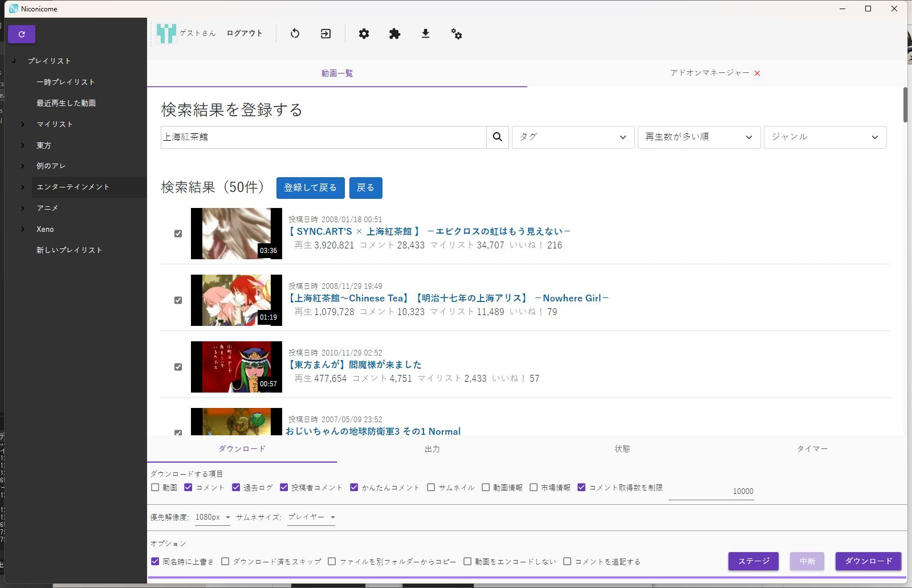
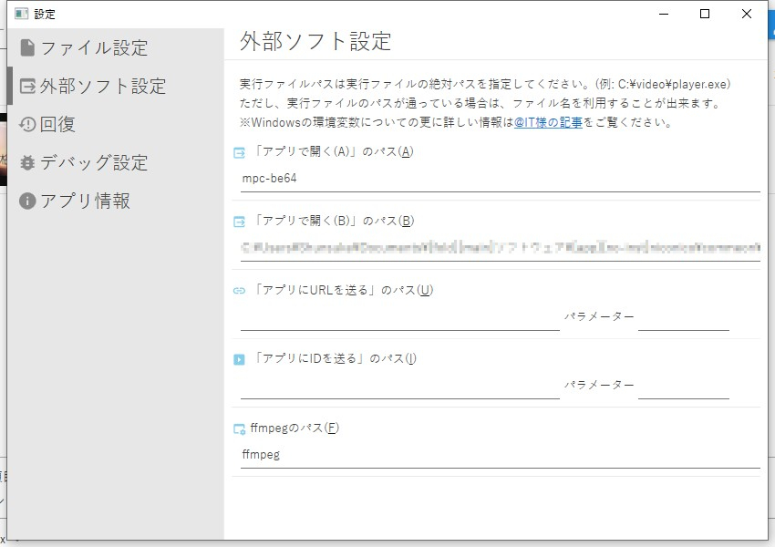

# Niconicome(α)
 

ニコニコ動画のコンテンツをダウンロードします。  
※テスト版のためバグが頻発する可能性があります。恐れ入りますが[Issues](https://github.com/Hayao-H/Niconicome/issues)からご報告ください。  
操作方法など詳しくは[Wiki](https://github.com/Hayao-H/Niconicome/wiki)をご覧ください。

## 機能
- 動画・サムネイル・コメントのダウンロード。
- 投稿者コメント、「かんたんコメント」、過去ログをオプションで取捨可能。
- 暗号化動画(公式アニメ)のコメント・サムネイルダウンロード。
- ローカルDBによるデータ管理。
- [AIMP](https://www.aimp.ru/)で再生可能な形式のプレイリストを出力。
- マイリスト、あとで見る(旧:とりあえずマイリスト)、ユーザー・チャンネル投稿動画からの一括登録。
- アプリ内ブラウザを利用したログインで連携ログイン・二段階認証などに対応。([WebView2 Runtime](#WebView2について)のインストールが必要です。)
- クリップボード・ニコニコでの検索結果からの動画登録に対応。
- 外部ソフトの起動。
- データベースファイルのバックアップ・復元。 
- NicomentXenoglossiaからのプレイリストデータ移行。
### 今後追加予定の機能
- Webview2・JavaScriptベースのプラグイン機能(未定・[ClearScript](https://github.com/microsoft/ClearScript)使用予定)。
## 実行する
#### インストール
特に設定は必要ありません。実行ファイルを任意のディレクトリに保存して実行してください。
#### アンインストール
現在、レジストリは使用していませんが、パスワードの保存にWIndowsの資格情報マネージャーの機能を使っています。パスワードを保存している場合は、「コントロールパネル>>資格情報マネージャー>>Windows資格情報」で「https://nicovideo.jp」を削除してください。  
**※他のアプリケーションがこの項目を使用している可能性があります。資格情報の削除は、影響を充分に理解した上で行ってください。**
### WebView2について
「ブラウザーでログイン」機能の利用には、WebView2 86.0.616.0以上のインストールが必要です。
[こちら](https://go.microsoft.com/fwlink/p/?LinkId=2124703)(ブートストラップリンク)からダウンロードしてください。また、ダウンロードページは[こちら](https://developer.microsoft.com/ja-jp/microsoft-edge/webview2/)です。
## 対応OS
WPFと.NET5を用いて開発しています。したがって、対応OSはそちらのサポートに依存します。現在、
- Windows 7 SP1 ESU
- Windows 8.1
- Windows10

に対応しています。詳しくは[こちら](https://docs.microsoft.com/ja-jp/dotnet/core/install/windows?tabs=net50)をご覧ください。  
※動作確認はWindows10 homeでのみ行っております。
#### 開発環境
- .NET5&WPF
- Visual Studio Community 2019
- VS Code
## スクリーンショット

