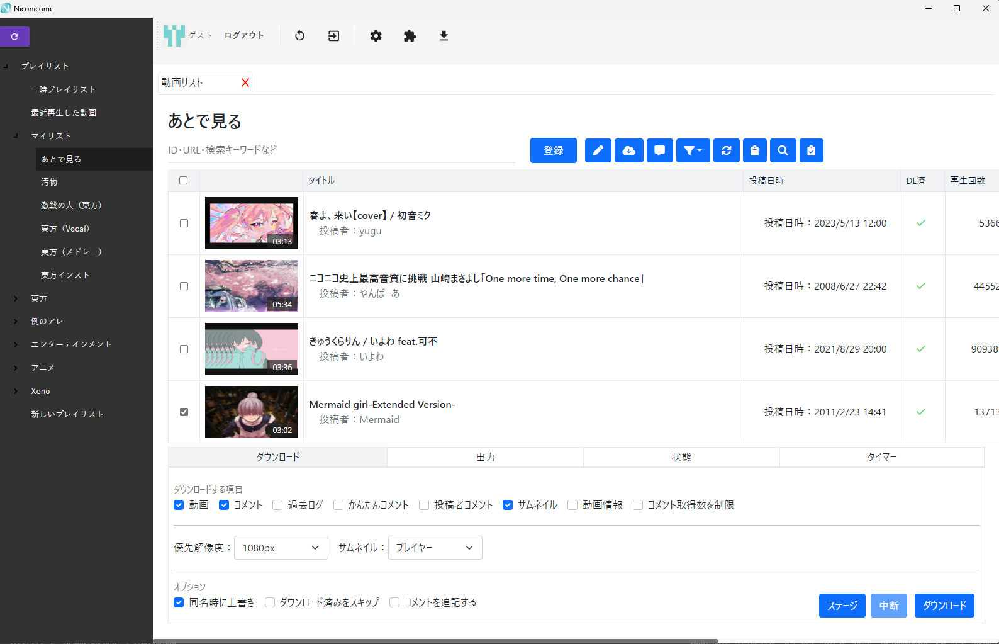
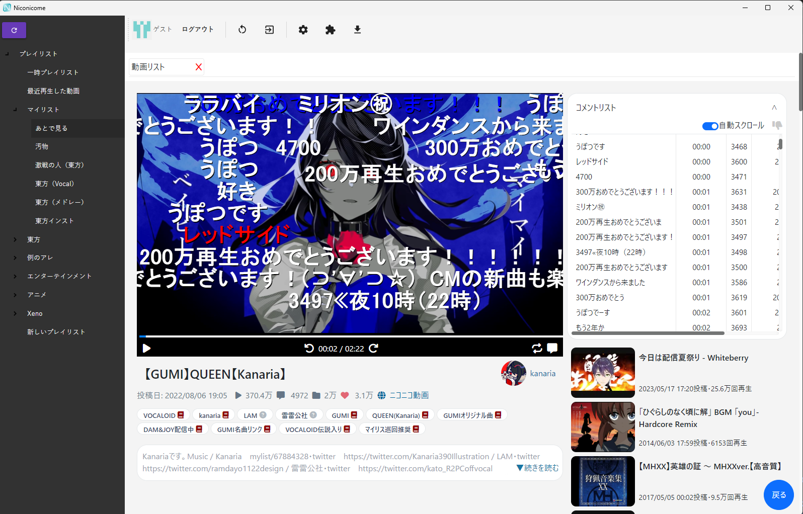
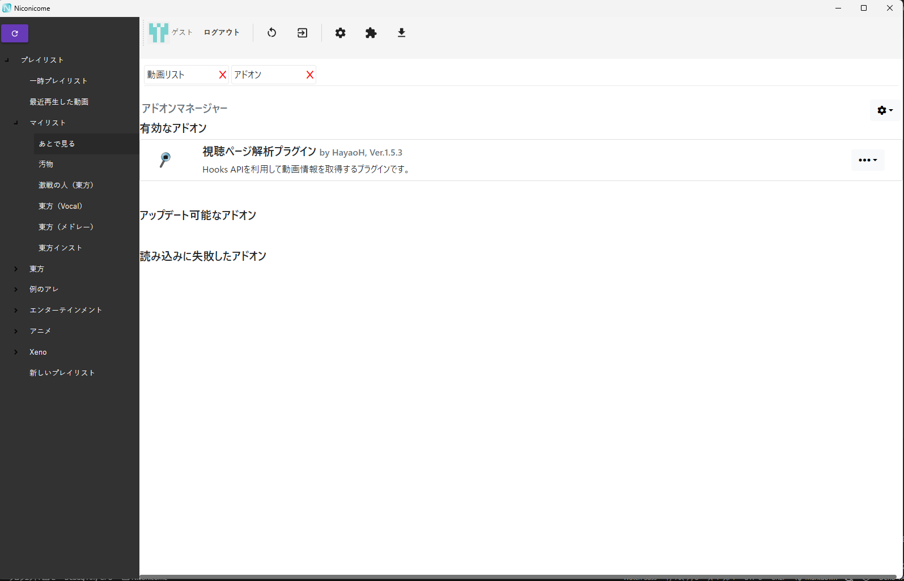

# Niconicome(α)
 

## 概要

ニコニコ動画のコンテンツをダウンロードします。  
※テスト版のためバグが頻発する可能性があります。恐れ入りますが[Issues](https://github.com/Hayao-H/Niconicome/issues)からご報告ください。  
操作方法など詳しくは[Wiki](https://github.com/Hayao-H/Niconicome/wiki)をご覧ください。

---

## 機能
- :new: 帰ってきたニコニコ動画に対応@[v0.14.0](https://github.com/Hayao-H/Niconicome/releases/tag/v0.14.0)
- :new: BlazorベースのWeb技術を用いたUI
- データのエクスポート・インポート（JSON形式）。 
- 動画・サムネイル・コメントのダウンロード。(:new: コメントサーバー移行に対応@[v0.12.0](https://github.com/Hayao-H/Niconicome/releases/tag/v0.12.0))
- 投稿者コメント、かんたんコメント、過去ログをオプションで取捨可能。
- 暗号化動画（公式アニメ）のコメント・サムネイルダウンロード。
- ローカルDBとJSONによるデータ管理。
- [AIMP](https://www.aimp.ru/)で再生可能な形式のプレイリストを出力。
- マイリスト、あとで見る(旧:とりあえずマイリスト)、ユーザー・チャンネル投稿動画からの一括登録。
- アプリ内ブラウザを利用したログインで連携ログイン・二段階認証などに対応。([WebView2 Runtime](#WebView2について)のインストールが必要です。)
- クリップボード・ニコニコでの検索結果からの動画登録に対応。
- 外部ソフトの起動。
- データベースファイルのバックアップ・復元。
- NicomentXenoglossiaからのプレイリストデータ移行。
- Mozilla Firefoxとのログイン連携。
- タイマー処理。指定時間にDLを開始できます。
- Webview2・JavaScriptベースのプラグイン機能([ClearScript](https://github.com/microsoft/ClearScript)を利用)。

---

## 注意
## 32bit版Windowsをお使いの方へ【重要】
同梱のffmpegは64bit版となっております。ご自分の責任の下に32bit版のffmpegのバイナリに差し替えてください。  
[「ffmpeg windows 32bit」のGoogle検索結果](https://www.google.com/search?q=ffmpeg+windows+32bit)

## ブラウザCookie取得以外でのログイン：パスワードログイン、二段階認証及びOAuth(外部ログイン提携)をご利用の方へ【重要】
- ログインの際に[WebView2](#webview2について)が必要になります。
- 詳しくは[こちら](https://github.com/Hayao-H/Niconicome/wiki/操作#ブラウザーでログイン)をご覧ください。

---

## 実行する
#### インストール
[Wiki](https://github.com/Hayao-H/Niconicome/wiki/Niconicome%E3%82%92%E4%BD%BF%E3%81%A3%E3%81%A6%E3%81%BF%E3%82%8B)をご覧ください。
#### アンインストール
現在、レジストリは使用していません。このため、実行ファイルを削除するだけでアンインストールできます。
### WebView2について
- ログインの際に、WebView2 86.0.616.0以上のインストールが必要です。
[こちら](https://go.microsoft.com/fwlink/p/?LinkId=2124703)(ブートストラップリンク)からダウンロードしてください。また、ダウンロードページは[こちら](https://developer.microsoft.com/ja-jp/microsoft-edge/webview2/)です。

---

## 対応OS
WPFと.NET8を用いて開発しています。したがって、対応OSはそちらのサポートに依存します。現在、
- Windows10
- Windows11

に対応しています。詳しくは[こちら](https://docs.microsoft.com/ja-jp/dotnet/core/install/windows?tabs=net50)をご覧ください。  
※動作確認はWindows101 homeでのみ行っております。

---

## 開発環境
- .NET8 & WPF
- Visual Studio Community 2022
- VS Code

---

## スクリーンショット

